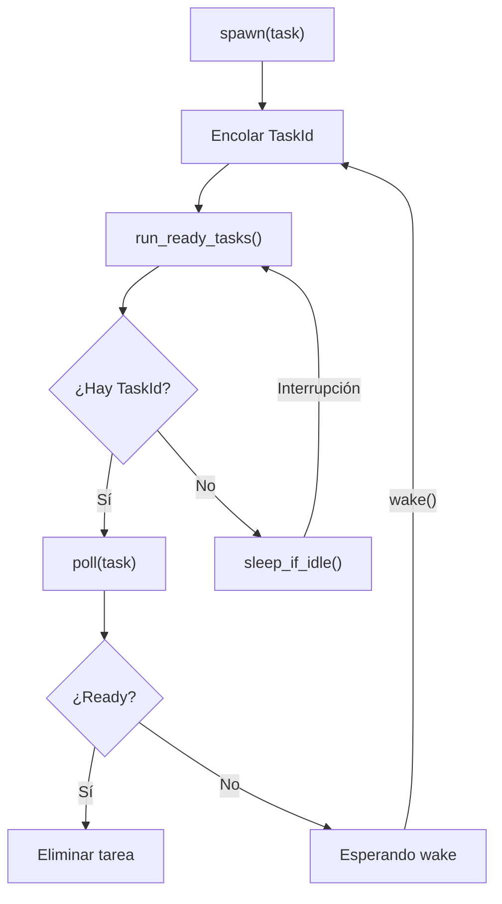

# Async/Await

> **Archivos:** `src/task/mod.rs`, `src/task/simple_executor.rs`, `src/task/executor.rs`, `src/task/keyboard.rs`
> **Propósito:** Multitarea cooperativa basada en futures de Rust, sin depender de `std`.

---

## Conceptos clave

### Future

Un `Future` representa un valor que todavía no está disponible. El runtime lo **pollea** hasta que devuelve `Poll::Ready(valor)`:

```rust
pub trait Future {
    type Output;
    fn poll(self: Pin<&mut Self>, cx: &mut Context) -> Poll<Self::Output>;
}
```

- `Pin<&mut Self>` — evita que el future se mueva en memoria (necesario para auto-referencias en `async fn`).
- `Context` — contiene un `Waker` que el future usa para avisar cuándo re-pollearlo.

### Waker

Un `Waker` es una callback que el executor usa para saber cuándo una tarea tiene progreso. Cuando se llama `.wake()`, el executor re-encola la tarea para pollearla.

---

## `Task` y `TaskId`

```rust
pub struct TaskId(u64); // auto-incremento con AtomicU64

pub struct Task {
    id: TaskId,
    future: Pin<Box<dyn Future<Output = ()>>>,
}
```

- Cada tarea wrappea un future `dyn Future<Output = ()>` pinneado en el heap.
- `TaskId` se genera automáticamente — nunca se repite.
- `Task::new()` acepta cualquier `impl Future<Output = ()> + 'static`.

---

## SimpleExecutor (executor ingenuo)

```rust
pub struct SimpleExecutor {
    task_queue: VecDeque<Task>,
}
```

### `dummy_raw_waker`

Como el `SimpleExecutor` no soporta wakers reales, usa un `RawWaker` cuyos 4 callbacks no hacen nada:

```rust
fn dummy_raw_waker() -> RawWaker {
    fn no_op(_: *const ()) {}
    fn clone(_: *const ()) -> RawWaker { dummy_raw_waker() }
    let vtable = &RawWakerVTable::new(clone, no_op, no_op, no_op);
    RawWaker::new(core::ptr::null(), vtable)
}
```

### `run()`

Loop simple: saca una tarea de la cola, la pollea, y si devuelve `Pending` la re-encola. Sale cuando la cola queda vacía.

> **Problema:** Hace busy-polling. Si una tarea nunca completa, el CPU gira indefinidamente.

---

## Executor con Wakers (executor eficiente)

```rust
pub struct Executor {
    tasks: BTreeMap<TaskId, Task>,
    task_queue: Arc<ArrayQueue<TaskId>>,
    waker_cache: BTreeMap<TaskId, Waker>,
}
```

### Flujo



### `TaskWaker`

Implementa el trait `Wake`. Cuando se llama `.wake()`, pushea el `TaskId` a la `task_queue`:

```rust
impl Wake for TaskWaker {
    fn wake(self: Arc<Self>) {
        self.task_queue.push(self.task_id).expect("cola llena");
    }
}
```

### `sleep_if_idle()`

Si no hay tareas listas, deshabilita interrupciones momentáneamente y ejecuta `hlt`. Esto evita una race condition entre el chequeo de la cola y el `hlt`:

```rust
fn sleep_if_idle(&self) {
    interrupts::disable();
    if self.task_queue.is_empty() {
        interrupts::enable_and_hlt(); // atómico
    } else {
        interrupts::enable();
    }
}
```

---

## Teclado async

### Arquitectura

```
[Interrupción HW] → add_scancode() → SCANCODE_QUEUE → ScancodeStream → print_keypresses()
                                            ↓
                                    WAKER.wake() → re-pollear stream
```

### `SCANCODE_QUEUE`

Cola lock-free (`ArrayQueue<u8>`) inicializada lazily con `OnceCell`. Capacidad 100 scancodes.

### `ScancodeStream`

Implementa el trait `Stream` (de `futures_util`):

```rust
fn poll_next(self: Pin<&mut Self>, cx: &mut Context) -> Poll<Option<u8>> {
    // 1. Intento rápido sin registrar waker
    if let Some(scancode) = queue.pop() {
        return Poll::Ready(Some(scancode));
    }
    // 2. Registrar waker y re-chequear (evita race condition)
    WAKER.register(cx.waker());
    match queue.pop() {
        Some(scancode) => { WAKER.take(); Poll::Ready(Some(scancode)) }
        None => Poll::Pending,
    }
}
```

> **Race condition evitada:** Se registra el waker *antes* del segundo chequeo. Si una interrupción llega entre el primer chequeo y el registro, el wake aún ocurre.

### Handler de interrupción simplificado

El handler de teclado en `interrupts.rs` ahora solo lee el port y encola:

```rust
let scancode: u8 = unsafe { port.read() };
crate::task::keyboard::add_scancode(scancode);
```

Toda la decodificación se mueve a la tarea async `print_keypresses()`.

---

## Integración en `main.rs`

```rust
let mut executor = Executor::new();
executor.spawn(Task::new(example_task()));
executor.spawn(Task::new(keyboard::print_keypresses()));
executor.run(); // nunca retorna
```

---

## SimpleRng (`src/rng.rs`)

Generador pseudo-aleatorio basado en LCG (Linear Congruential Generator) con constantes de glibc:

```rust
self.state = self.state.wrapping_mul(6364136223846793005).wrapping_add(1);
```

- `wrapping_mul` / `wrapping_add` — overflow silencioso (equivale a `mod 2^64`)
- Semilla fija → secuencia reproducible (útil para tests)
- `next_range(min, max)` — genera un valor en `[min, max)`

---

## Heap Stress Test (`src/task/stress_test.rs`)

Tarea async que estresa el allocator con asignaciones/liberaciones aleatorias:

| Parámetro | Valor |
|-----------|-------|
| Iteraciones | 5000 |
| Ratio alloc/dealloc | 70% / 30% |
| Tamaño de objetos | 8–256 bytes |
| Máx. objetos vivos | 50 |

Lleva un `StressStats` interno que cuenta todo sin instrumentar `allocator.rs`:

```
=== Heap Stress Test — Resultados ===
  Asignaciones:      2524
  Liberaciones:      2524
  Bytes asignados:   330498
  Bytes liberados:   330498
  Bytes en uso:      0
  Pico de objetos:   50
```

Test de integración en `tests/heap_stress.rs`.

---

## Tests (`tests/async_task.rs`)

| Test | Qué verifica |
|------|-------------|
| `test_simple_executor_runs_task` | Que una tarea async ejecuta y modifica un `AtomicBool` |
| `test_task_id_unique` | Que `Task::new` no paniquea (IDs se generan correctamente) |
| `test_simple_executor_multiple_tasks` | Que 3 tareas incrementan un contador a 3 |
| `test_async_value_propagation` | Que `await` propaga valores entre futures |

---

## Dependencias agregadas

| Crate | Propósito |
|-------|-----------|
| `crossbeam-queue` | `ArrayQueue` — cola lock-free, bounded |
| `conquer-once` | `OnceCell` para `no_std` |
| `futures-util` | Traits `Stream`, `StreamExt`, `AtomicWaker` |

> Todas con `default-features = false` porque el kernel no tiene `std`.
